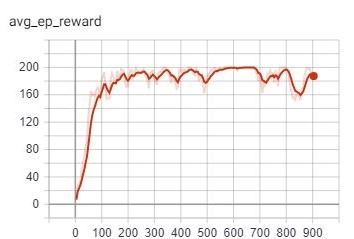
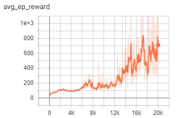

# Promixal Policy Optimization with PyTorch  
This repository implements [promixal policy optimization](https://arxiv.org/abs/1707.06347) using the PyTorch Lightning package. [PyTorch Lightning](https://github.com/PyTorchLightning/pytorch-lightning) helps reduce boilerplate code and modularize model training. Hence, different parts such as the loss function, advantage calculation, or training configurations can be easily modified as per users' experiments. 

This implementation is inspired by OpenAI baselines for [PPO](https://github.com/openai/baselines/tree/master/baselines/ppo2) and implementation 
of other RL algorithms in [PyTorch Lightning Bolts](https://github.com/PyTorchLightning/pytorch-lightning-bolts/)

## Details 
This PPO implemenation works with both discrete and continous action-space environments via OpenAI Gym. Implements PPO Actor-Critic style. 

GPU training is supported through Lightning, `trainer = Trainer(gpus=-1)`. Note: If the user is using deeper networks for actor or critic, instead of the default MLP, only then will GPU speedups likely be realized.  

## Requirements 
* Python3 >= 3.6 
* OpenAI Gym 
* PyTorch
* PyTorch Lightning 

## Results 
Results with default parameters on some environments. PyBullet's gym envirnoment was used instead of MuJoCo for Hopper and Walker. 

Parameters:  
`batch_size = 512`, `nb_optim_iters = 4`, `clip_ratio = 0.2`, `gamma = 0.99`, 
`lam = 0.95`, `lr_actor = 3e-4`, `lr_critic = 1e-3`

| CartPole-v0    | HopperBulletEnv-v0 | Walker2DBulletEnv-v0 |
| -------------- | -------------- | -------------- |  
|  |  |  |
